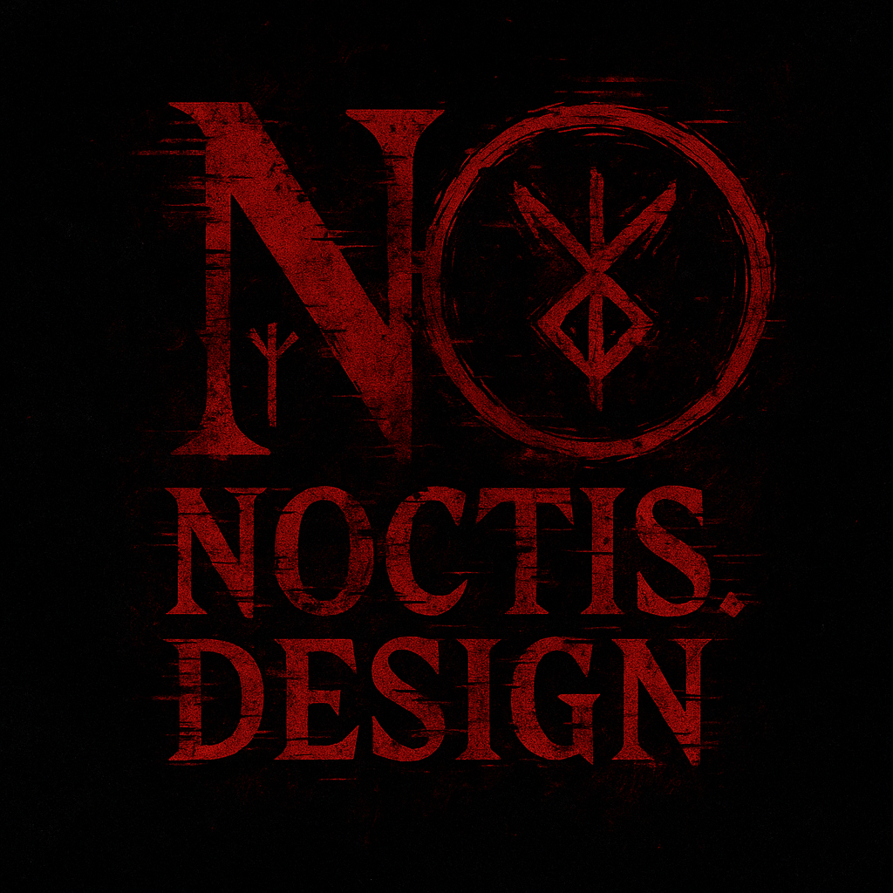

# Slavic Mythology — Dark Web Experience

  
*(Dodaj banner ili logo ovde ako imaš)*

---

## About

This is a **dark, glitch-inspired React project** exploring the mysterious and ancient world of **Slavic mythology**. Dive into forgotten gods, ancient runes, and rituals wrapped in shadows and blood-red hues.

Explore a digital resurrection of Slavic pagan beliefs with immersive UI animations and thematic design that evokes a sense of mystery and the occult.

---

## Features

- Dark, atmospheric UI with crimson and black color scheme  
- Animated titles with bleeding/dripping text effects  
- Responsive design optimized for mobile and desktop  
- Interactive cards showcasing Slavic gods with lore snippets  
- Sections for gods, rituals, symbols, and mythology history  
- Glitch-inspired animations and subtle flickering effects  
- Easy navigation and clean React component structure

---

## Tech Stack

- React (with functional components and hooks)  
- Vite for fast development and build  
- CSS animations and custom styling for dark, creepy vibe  
- Modular file structure (components, styles, data)

---

## Installation

1. Clone the repo  
```bash
git clone https://github.com/yourusername/slavic-mythology.git
